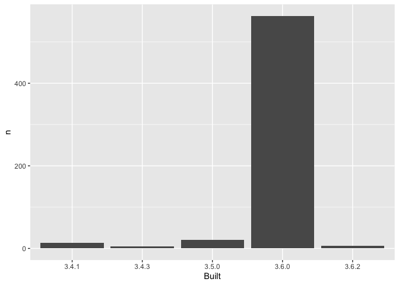

01\_write-installed-packages.R
================
yhagar
2020-01-27

``` r
library(tidyverse)
```

    ## ── Attaching packages ────────────────────────────────────────────────── tidyverse 1.3.0 ──

    ## ✓ ggplot2 3.2.1     ✓ purrr   0.3.3
    ## ✓ tibble  2.1.3     ✓ dplyr   0.8.3
    ## ✓ tidyr   1.0.0     ✓ stringr 1.4.0
    ## ✓ readr   1.3.1     ✓ forcats 0.4.0

    ## ── Conflicts ───────────────────────────────────────────────────── tidyverse_conflicts() ──
    ## x dplyr::filter() masks stats::filter()
    ## x dplyr::lag()    masks stats::lag()

``` r
## create a data frame of your installed packages
## hint: installed.packages() is the function you need
pkgs <- as_tibble(installed.packages())

## filter out the base and recommended packages
## keep the variables Package and Built
## if you use dplyr, code like this will work:
apt <- pkgs %>%
  dplyr::filter(is.na(Priority)) %>%
  dplyr::select(Package, Built)

apt_freqtable <- apt %>%
  dplyr::count(Built) %>%
  dplyr::mutate(prop = n / sum(n))


ggplot2::ggplot(apt_freqtable, aes(x = Built, y = n)) +
  geom_col()
```

<!-- -->
